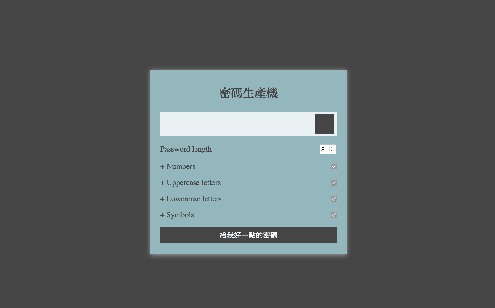

### Password Generater - code along
An javascript project, to generate random password.

## Task
This is a code along project to create a password generate application, user can choose if they want capitalize charactor, special characotr and numbers.

## Function
This project generate random passwords with copy button.

## Tech Stack
* DOM
* Javascript
* CSS
* HTML
